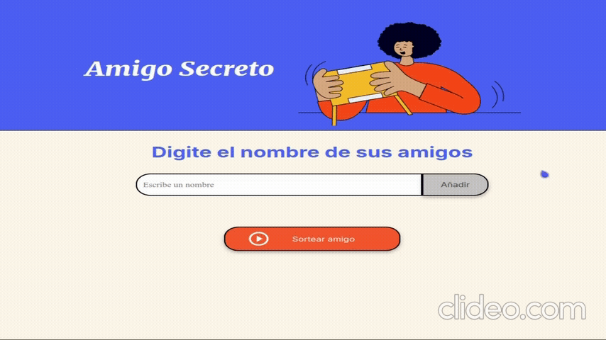

# Challenge del Amigo Secreto 

___

___
#### Nota: 
Este proyecto es de carácter educativo y fue desarrollado durante el programa [Oracle Next Education - Alura Latam](https://www.aluracursos.com/empresas/one).  
No tiene fines comerciales ni está licenciado bajo un esquema de código abierto tradicional (MIT, GPL, etc.).
___

## Indice
- [Titulo](#challenge-del-amigo-secreto)
- [Aclaración](#nota)
- [Indice](#indice)
- [Descripción](#descripción)
- [Características](#características)
- [Acceso](#acceso)
- [Tecnologías](#tecnologías)
- [Autor](#autor)
___
### Descripción

El Challenge del Amigo Secreto es una sencilla pero divertida aplicación web que permite organizar un sorteo de nombres para jugar al tradicional "amigo secreto" (o "intercambio de regalos"). Solo necesitas escribir los nombres de los participantes, añadirlos a la lista y presionar el botón de sorteo. La aplicación seleccionará al azar un amigo para ti.
___
### Características
* Interfaz amigable y en español,
* Validación para evitar entradas vacias o caracteres no permitidos,
* Sorteo aleatorio de un nombre de la lista,
* Ideal para grupos pequeños o actividades familiares.

#### Preview

#### Explicación de codigo

El proyecto se basa en tres funciones principales:

`agregaAmigo()`: Agrega un nombre válido a la lista de amigos.

`listarAmigos()`: Actualiza dinámicamente la lista mostrada en pantalla.

`sortearAmigo()`: Selecciona aleatoriamente un nombre de la lista.

Se valida que:
- El nombre o la lista no estén vacíos (`esElementoVacio()`).
- Solo contenga letras (`isWord()`).
___
### Acceso
Es posible acceder a la aplicación desde este enlace:

👉 [Ir al juego](https://stredhy.github.io/SecretNumberChallenge/)
___
### Tecnologías
* HTML
* JavaScript
* CSS
* GoogleApis
* Gstatic
___

### Autor

  
**Stredhy**  

